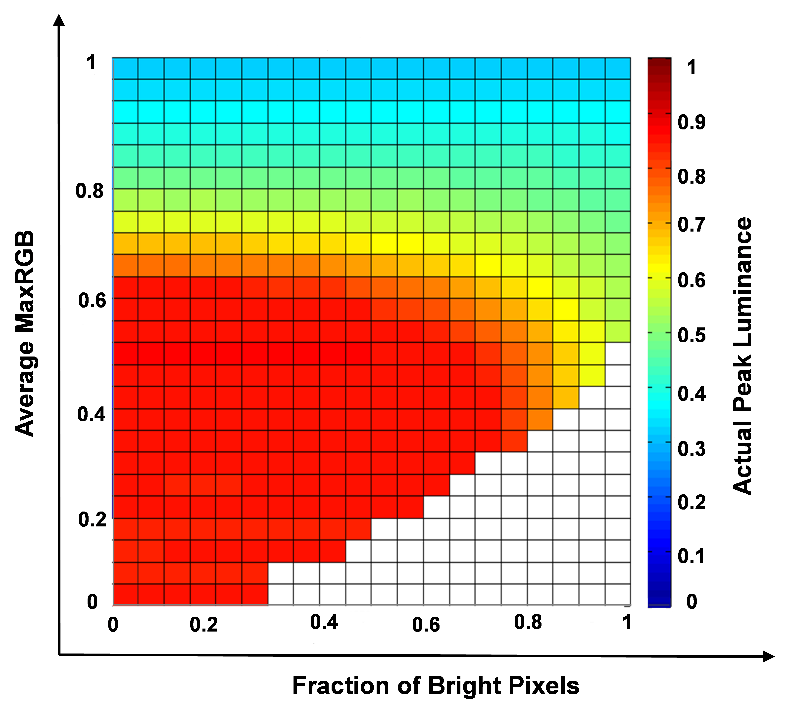

# Style Recommendations

## Notes

NOTE: This is purely informational

## Examples

EXAMPLE: 5 oranges

## Equations

The tone mapping offset, gain and gamma values shall be applied according to the equation:

+-----------------------------------------------+-------:+
|  $y=( min( max(0,(x  \times g) + o ),1) )^P$  | ( 1 )  |
+-----------------------------------------------+--------+

where
`y` is the output value
`x` is the input value
`g` is the value of Tone Mapping Gain
`o` is the value of Tone Mapping Offset
`p` is the value of Tone Mapping Gamma

## Figures

## Tables

Table: Example Metadata sets with Time Intervals

| Example set  |  TimeIntervalStart  |  TimeIntervalDuration
| ------------ | :-----------------: | :------------------: |
| Application Set A | 0 | 2
| Application Set B | 0 | 3
| Application Set C | 5 | 2
